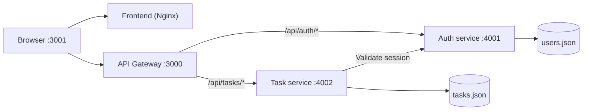

# Lumina task manager

Lumina is a small, container-ready Node.js task manager built with microservices. It includes user registration, secure session-based authentication, and a private task dashboard with priorities, deadlines, statuses, and deletion.

## What it does

- Create an account with a username, email, and password.
- Sign in and sign out with cookie-based sessions.
- Create tasks that belong only to the signed-in user.
- Assign Low, Medium, or High priority.
- Set an optional deadline.
- Mark tasks as Completed, reopen them as Pending, or delete them.
- Route browser API requests through a dedicated API Gateway.

## Architecture



The frontend is served at port `3001`. Its browser JavaScript calls the gateway at port `3000`; the gateway forwards auth and task requests to the correct internal service.

## Prerequisites

Choose one way to run the project:

- Docker Desktop with Docker Compose (recommended), or
- Node.js 22+ for the backend services plus any static web server for the frontend.

Verify Docker is available:

```powershell
docker --version
docker compose version
```

## Installation and quick start

1. Open PowerShell in the project directory.

```powershell
cd "E:\microservice application"
```

2. Build and start the complete stack.

```powershell
docker compose up --build
```

3. Open [http://localhost:3001](http://localhost:3001).

4. Register an account, then add and manage tasks from the dashboard.

The first build may take a few minutes while Docker downloads the Node and Nginx images. Subsequent starts only require:

```powershell
docker compose up
```

## Stop or reset the application

Stop containers while retaining existing data:

```powershell
docker compose down
```

Rebuild images after service or frontend changes:

```powershell
docker compose up --build
```

## Service addresses

| Component | Address | Purpose |
| --- | --- | --- |
| Frontend | [http://localhost:3001](http://localhost:3001) | Login, registration, and task dashboard. |
| API Gateway | [http://localhost:3000](http://localhost:3000) | Single browser-facing API entry point. |
| Auth service | `http://localhost:4001` | Account and session service. |
| Task service | `http://localhost:4002` | Task management service. |

## Project structure

```text
microservice-application/
|- api-gateway/          # Proxies auth and task API routes
|- auth-service/         # Registration, login, logout, sessions, user data
|- task-service/         # Task CRUD, status, priority, deadline data
|- frontend/             # Static HTML, CSS, browser JavaScript, Nginx Dockerfile
|- docker-compose.yml    # Runs all four containers together
|- package.json          # Convenience scripts for local service starts
`- README.md
```

## Run services without Docker

The application is designed around Docker Compose. If you need to run the Node services directly, open three PowerShell terminals in the project root and run:

```powershell
npm run start:gateway
```

```powershell
npm run start:auth
```

```powershell
npm run start:tasks
```

You must also serve `frontend/` at `http://localhost:3001` for the browser app to work. Docker Compose already provides this through Nginx, so it is the easiest local setup.

## API Gateway routing

All browser API traffic goes through `http://localhost:3000`.

| Gateway route | Forwarded to |
| --- | --- |
| `/api/auth/*` | Auth service `/api/*` |
| `/api/tasks/*` | Task service `/api/tasks/*` |

The gateway preserves session cookies and applies CORS headers for the frontend origin.

### Authentication endpoints

| Method | Endpoint | Description |
| --- | --- | --- |
| `POST` | `/api/auth/register` | Creates a user and starts a session. |
| `POST` | `/api/auth/login` | Verifies email and password, then starts a session. |
| `GET` | `/api/auth/session` | Returns the current authenticated user. |
| `POST` | `/api/auth/logout` | Ends the active session. |

### Task endpoints

| Method | Endpoint | Description |
| --- | --- | --- |
| `GET` | `/api/tasks` | Lists tasks for the signed-in user. |
| `POST` | `/api/tasks` | Creates a task with `title`, `priority`, and optional `deadline`. |
| `PATCH` | `/api/tasks/:id` | Changes `status` to `pending` or `completed`. |
| `DELETE` | `/api/tasks/:id` | Deletes a task owned by the signed-in user. |

Example request body for a new task:

```json
{
  "title": "Prepare project demo",
  "priority": "high",
  "deadline": "2026-09-01"
}
```

## Configuration

| Service | Variable | Default | Purpose |
| --- | --- | --- | --- |
| API Gateway | `PORT` | `3000` | Gateway listening port. |
| API Gateway | `AUTH_SERVICE_URL` | `http://localhost:4001` | Auth-service upstream address. |
| API Gateway | `TASK_SERVICE_URL` | `http://localhost:4002` | Task-service upstream address. |
| API Gateway | `WEB_ORIGIN` | `http://localhost:3001` | Allowed browser origin for CORS. |
| Auth service | `PORT` | `4001` | Auth-service listening port. |
| Auth service | `NODE_ENV` | — | Set to `production` behind HTTPS to add the cookie `Secure` flag. |
| Task service | `PORT` | `4002` | Task-service listening port. |
| Task service | `AUTH_SERVICE_URL` | `http://localhost:4001` | Auth service used to validate sessions. |

Docker Compose sets internal service URLs automatically, so no manual configuration is required for the standard setup.

## Data and security

- `auth-service/data/users.json` stores usernames, emails, password salts, and PBKDF2-SHA256 password hashes.
- `task-service/data/tasks.json` stores tasks, priority, deadline, status, and owner ID.
- Passwords are never stored in plain text or made available to the task service.
- The task service validates the session with the auth service for every task request.
- Sessions use `HttpOnly` and `SameSite=Lax` cookies and expire after eight hours.

## Troubleshooting

| Problem | What to try |
| --- | --- |
| Port is already in use | Stop the conflicting process, or change the exposed port in `docker-compose.yml`. |
| Page does not load | Confirm containers are running with `docker compose ps`, then open `http://localhost:3001`. |
| Login or task request fails | Check service logs with `docker compose logs api-gateway auth-service task-service`. |
| Frontend changes do not appear | Rebuild the frontend: `docker compose up --build`. |
| Reset local data | Delete the JSON files under `auth-service/data/` and `task-service/data/` only if you are happy to remove local accounts and tasks. |

## Useful Docker commands

```powershell
# See running containers
docker compose ps

# Follow logs from every service
docker compose logs -f

# Follow only the gateway logs
docker compose logs -f api-gateway

# Start the stack in the background
docker compose up -d --build
```
