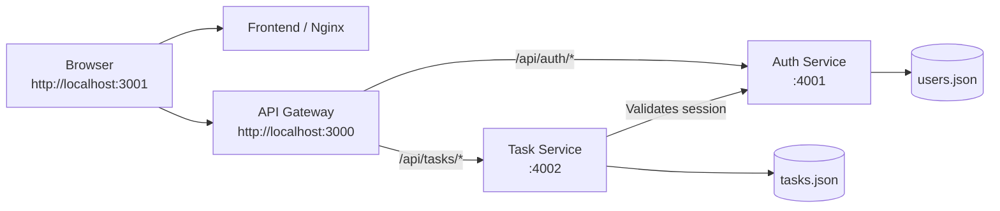

# Lumina task manager — microservices

Lumina is a containerized Node.js task manager split into independent authentication and task services. A browser-facing API Gateway routes requests to the correct service, while a lightweight Nginx container serves the frontend.

## Architecture



## Features

- Register with username, email, and password
- Cookie-based login, logout, and session validation
- User-specific task lists
- Create tasks with Low, Medium, or High priority
- Optional task deadline dates
- Pending and Completed task status
- Mark tasks complete, reopen them, or delete them
- API Gateway routing and CORS handling
- Docker Compose environment for all services

## Project layout

```text
microservice-application/
├── api-gateway/        # Node.js reverse proxy for API routes
├── auth-service/       # User registration, login, sessions, users.json
├── task-service/       # Task CRUD, task status, tasks.json
├── frontend/           # Static HTML, CSS, and browser JavaScript
├── docker-compose.yml  # Full local container environment
├── package.json
└── README.md
```

## Run with Docker Compose

This is the recommended way to run the full application:

```powershell
docker compose up --build
```

Open [http://localhost:3001](http://localhost:3001).

| Component | Host address | Container port |
| --- | --- | --- |
| Frontend (Nginx) | `http://localhost:3001` | `80` |
| API Gateway | `http://localhost:3000` | `3000` |
| Auth service | `http://localhost:4001` | `4001` |
| Task service | `http://localhost:4002` | `4002` |

To stop the stack:

```powershell
docker compose down
```

## Run services directly

Each Node.js service can also run independently:

```powershell
npm run start:gateway
npm run start:auth
npm run start:tasks
```

When running directly, serve the `frontend` folder from any static web server at `http://localhost:3001`, or use Docker Compose for the frontend container.

## API Gateway routes

The browser calls the gateway at `http://localhost:3000`. The gateway forwards requests as follows:

| Gateway route | Destination |
| --- | --- |
| `/api/auth/*` | Auth service `/api/*` |
| `/api/tasks/*` | Task service `/api/tasks/*` |

### Authentication

| Method | Gateway endpoint | Description |
| --- | --- | --- |
| `POST` | `/api/auth/register` | Creates a user and starts a session. |
| `POST` | `/api/auth/login` | Verifies credentials and starts a session. |
| `GET` | `/api/auth/session` | Returns the authenticated user. |
| `POST` | `/api/auth/logout` | Ends the active session. |

### Tasks

| Method | Gateway endpoint | Description |
| --- | --- | --- |
| `GET` | `/api/tasks` | Lists tasks for the signed-in user. |
| `POST` | `/api/tasks` | Creates a task with `title`, `priority`, and optional `deadline`. |
| `PATCH` | `/api/tasks/:id` | Sets a task status to `pending` or `completed`. |
| `DELETE` | `/api/tasks/:id` | Deletes one of the signed-in user's tasks. |

## Configuration

| Service | Variable | Default | Purpose |
| --- | --- | --- | --- |
| API Gateway | `PORT` | `3000` | Gateway listening port. |
| API Gateway | `AUTH_SERVICE_URL` | `http://localhost:4001` | Auth-service upstream URL. |
| API Gateway | `TASK_SERVICE_URL` | `http://localhost:4002` | Task-service upstream URL. |
| API Gateway | `WEB_ORIGIN` | `http://localhost:3001` | Allowed frontend origin. |
| Auth service | `PORT` | `4001` | Auth-service listening port. |
| Auth service | `NODE_ENV` | — | Use `production` behind HTTPS to add the `Secure` cookie flag. |
| Task service | `PORT` | `4002` | Task-service listening port. |
| Task service | `AUTH_SERVICE_URL` | `http://localhost:4001` | Auth-service URL used for session validation. |

## Data and security

- `auth-service/data/users.json` stores usernames, email addresses, salts, and PBKDF2-SHA256 password hashes.
- `task-service/data/tasks.json` stores task data only; passwords are never available to the task service.
- The task service calls the auth service to validate the session before every task request.
- Sessions use `HttpOnly` and `SameSite=Lax` cookies and expire after eight hours.
- The API Gateway preserves session cookies while proxying responses and is the single browser-facing API endpoint.
