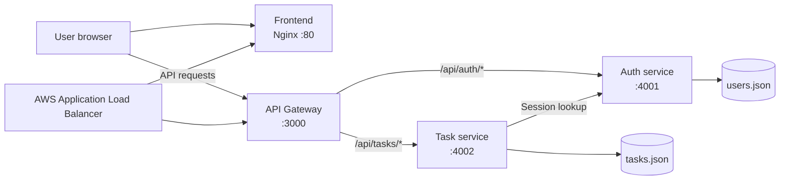

# Lumina Task Manager

Lumina is a task-management application built as four deployable components: a static frontend, an API Gateway, an authentication service, and a task service. The repository includes local Docker development, Jenkins CI/CD, and Terraform infrastructure for AWS ECS Fargate.

## Features

- Account registration with username, email, and password validation
- Login, logout, and eight-hour cookie sessions
- Password hashing with PBKDF2-SHA256 and constant-time verification
- Per-user task lists
- Task creation with priority (`low`, `medium`, or `high`) and an optional deadline
- Pending/completed task status, including complete and reopen actions
- Task deletion
- Gateway-based auth and task API routing, CORS handling, and a `/health` endpoint
- Docker Compose development with Nodemon hot reload for Node.js services
- Jenkins pipeline for Compose validation, smoke testing, Amazon ECR image publishing, and ECS redeployment
- Terraform for AWS VPC, ALB, ECS Fargate, ECR, Cloud Map, IAM, and CloudWatch logs

## Architecture



### Request flow

1. The frontend is served by Nginx.
2. Browser JavaScript calls the API Gateway rather than a backend service directly.
3. The gateway forwards `/api/auth/*` to auth-service and `/api/tasks/*` to task-service.
4. Task-service forwards the session cookie to auth-service before serving every task request.
5. Auth-service owns user credentials and sessions; task-service owns task data only.

## Repository layout

```text
microservice-application/
|- frontend/             # Static UI, Nginx Docker image
|- api-gateway/          # Node.js reverse proxy and health endpoint
|- auth-service/         # Registration, login, sessions, user data
|- task-service/         # Task CRUD and task data
|- terraform/            # AWS ECS/Fargate infrastructure
|- docker-compose.yml    # Local four-container development stack
|- Jenkinsfile           # CI/CD pipeline
|- package.json          # Local service scripts
`- README.md
```

## Prerequisites

### For local Docker development (recommended)

- [Docker Desktop](https://www.docker.com/products/docker-desktop/) with Docker Compose v2
- Git (optional, for cloning)

Verify your Docker installation:

```powershell
docker --version
docker compose version
```

### For running Node.js services outside Docker

- Node.js 22 or newer
- npm
- A static web server for `frontend/` that serves it at `http://localhost:3001`

### For AWS deployment

- Terraform `>= 1.5.0`
- AWS CLI configured with an account allowed to create ECR, VPC, ECS, ALB, IAM, Cloud Map, and CloudWatch resources
- AWS region `ap-south-1` by default

## Installation and local quick start

1. Open PowerShell in the repository.

```powershell
cd "E:\microservice application"
```

2. Build and start the complete stack.

```powershell
docker compose up --build
```

3. Open [http://localhost:3001](http://localhost:3001).

4. Register an account, sign in, and create tasks from the dashboard.

The initial build downloads the Node.js and Nginx images. Subsequent runs can use:

```powershell
docker compose up
```

## Local service addresses

| Component | Host address | Purpose |
| --- | --- | --- |
| Frontend | [http://localhost:3001](http://localhost:3001) | Login, registration, and task dashboard |
| API Gateway | [http://localhost:3000](http://localhost:3000) | Browser-facing API entry point |
| Gateway health | [http://localhost:3000/health](http://localhost:3000/health) | Returns `{ "status": "ok" }` |
| Auth service | `http://localhost:4001` | User and session API |
| Task service | `http://localhost:4002` | Task API |

## Docker development workflow

Compose mounts the three Node.js service source folders and starts them with Nodemon, so edits to their `server.js` files automatically restart the relevant service.

```powershell
# Start in the foreground
docker compose up --build

# Start in the background
docker compose up -d --build

# View status
docker compose ps

# Follow all logs
docker compose logs -f

# Follow one service
docker compose logs -f api-gateway

# Stop containers while preserving the workspace data files
docker compose down
```

## Run Node.js services directly

Install each service's development dependency first:

```powershell
npm install
npm --prefix api-gateway install
npm --prefix auth-service install
npm --prefix task-service install
```

Then start the services in three separate terminals:

```powershell
npm run start:gateway
```

```powershell
npm run start:auth
```

```powershell
npm run start:tasks
```

For hot reload, run `npm run dev` inside each service folder. You must separately serve `frontend/` at `http://localhost:3001`; Docker Compose already does this through Nginx.

## Gateway routes and API

The frontend sends all API traffic to the gateway.

| Gateway route | Upstream route |
| --- | --- |
| `/api/auth/*` | Auth service `/api/*` |
| `/api/tasks/*` | Task service `/api/tasks/*` |

### Authentication API

| Method | Endpoint | Description |
| --- | --- | --- |
| `POST` | `/api/auth/register` | Creates a user and session cookie |
| `POST` | `/api/auth/login` | Validates credentials and starts a session |
| `GET` | `/api/auth/session` | Returns the signed-in user |
| `POST` | `/api/auth/logout` | Clears the active session |

### Task API

| Method | Endpoint | Description |
| --- | --- | --- |
| `GET` | `/api/tasks` | Lists the signed-in user's tasks, ordered by priority |
| `POST` | `/api/tasks` | Creates a task |
| `PATCH` | `/api/tasks/:id` | Sets `status` to `pending` or `completed` |
| `DELETE` | `/api/tasks/:id` | Deletes a task owned by the signed-in user |

Example task payload:

```json
{
  "title": "Prepare project demo",
  "priority": "high",
  "deadline": "2026-09-01"
}
```

## Configuration

| Service | Variable | Default | Purpose |
| --- | --- | --- | --- |
| API Gateway | `PORT` | `3000` | Gateway listening port |
| API Gateway | `AUTH_SERVICE_URL` | `http://localhost:4001` | Auth-service upstream URL |
| API Gateway | `TASK_SERVICE_URL` | `http://localhost:4002` | Task-service upstream URL |
| API Gateway | `WEB_ORIGIN` | `http://localhost:3001` | Allowed CORS origin |
| Auth service | `PORT` | `4001` | Auth-service listening port |
| Auth service | `NODE_ENV` | — | Set to `production` behind HTTPS to add `Secure` to cookies |
| Task service | `PORT` | `4002` | Task-service listening port |
| Task service | `AUTH_SERVICE_URL` | `http://localhost:4001` | Auth-service session-validation URL |

`docker-compose.yml` supplies internal Docker service URLs automatically.

## Data and security

- `auth-service/data/users.json` stores user IDs, usernames, emails, salts, and PBKDF2-SHA256 password hashes.
- `task-service/data/tasks.json` stores task IDs, owner IDs, title, priority, deadline, status, and timestamps.
- Task-service never receives or stores passwords.
- Login uses constant-time hash comparison.
- Session cookies are `HttpOnly` and `SameSite=Lax`; their lifetime is eight hours.
- The gateway preserves `Set-Cookie` headers from upstream responses.

> The JSON files are appropriate for local development. For production, replace them with durable managed storage and keep credentials/secrets outside the repository.

## CI/CD with Jenkins

The included [Jenkinsfile](Jenkinsfile) defines a Windows-oriented pipeline that:

1. Checks out the repository.
2. Validates Docker Compose.
3. Builds images and smoke-tests `http://localhost:3000/health`.
4. Logs in to Amazon ECR using Jenkins credential ID `AWS-access`.
5. Tags and pushes API Gateway, Auth, Task, and Frontend images to ECR.
6. Forces new deployments for all four ECS services in `lumina-cluster`.

The Jenkins agent needs Docker, Docker Compose, AWS CLI, and Windows batch (`bat`) support. Configure `AWS-access` as an AWS access key ID / secret access key credential with ECR and ECS permissions.

## AWS infrastructure with Terraform

Terraform in `terraform/` provisions:

- VPC with two public subnets, Internet Gateway, and route table
- Security groups for the Application Load Balancer and ECS tasks
- Four Amazon ECR repositories with image scanning on push
- ECS cluster and four Fargate services
- Cloud Map DNS names: `auth.lumina.local` and `task.lumina.local`
- Application Load Balancer: frontend by default and gateway for `/api/*`
- CloudWatch log groups with seven-day retention
- ECS task execution IAM role

### Deploy infrastructure

```powershell
cd terraform
terraform init
terraform fmt -check
terraform validate
terraform plan
terraform apply
```

Terraform outputs the ALB DNS name and ECR repository URLs after applying.

> AWS resources incur charges. Review `terraform plan` carefully and remove resources when finished:

```powershell
terraform destroy
```

## Troubleshooting

| Problem | Suggested check |
| --- | --- |
| A container will not start | Run `docker compose logs <service-name>` and confirm the required port is free. |
| Frontend does not load | Confirm `docker compose ps` shows `frontend` running, then visit port `3001`. |
| Login or tasks fail | Confirm the gateway health endpoint works, then inspect gateway, auth, and task logs. |
| Task API returns 401 | Sign in again and confirm `AUTH_SERVICE_URL` is reachable from task-service. |
| Gateway returns 503 | Check the corresponding upstream service is running and its URL is correct. |
| Frontend appears stale | Rebuild it with `docker compose up --build`. |
| Need a clean local state | Delete JSON files under the service `data/` folders only if you intend to remove local users or tasks. |
